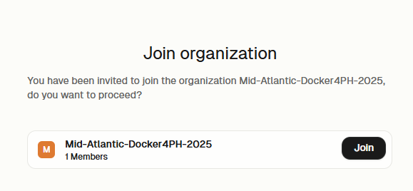
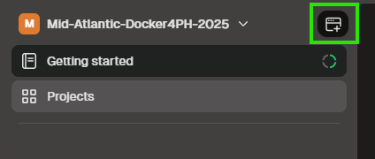
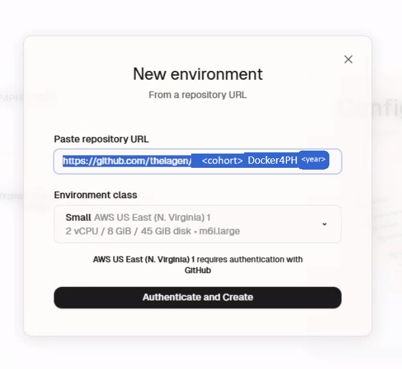
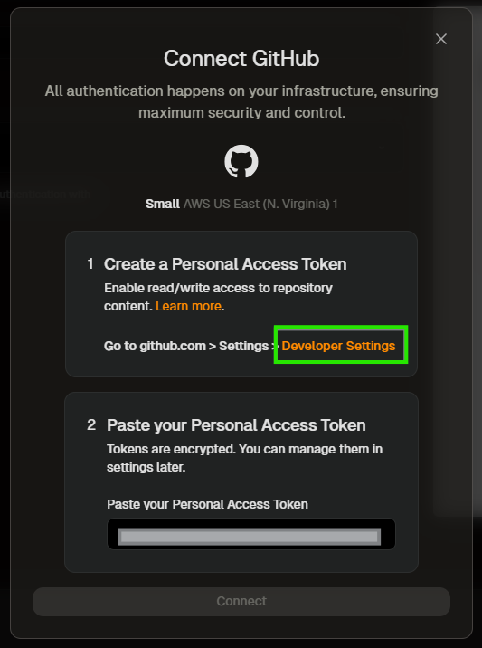
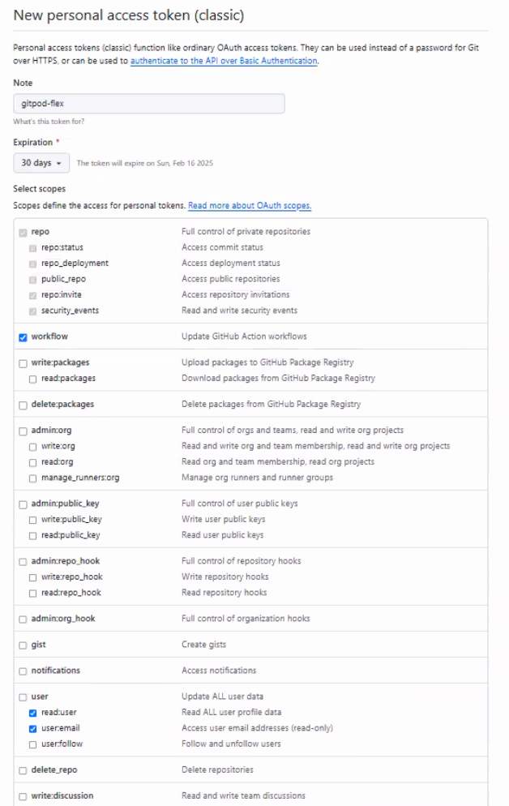
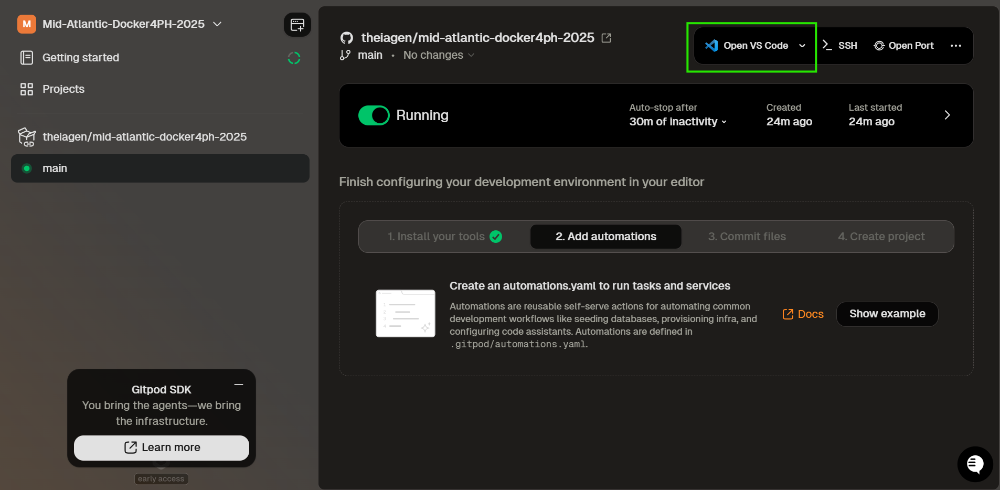
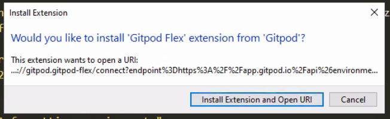
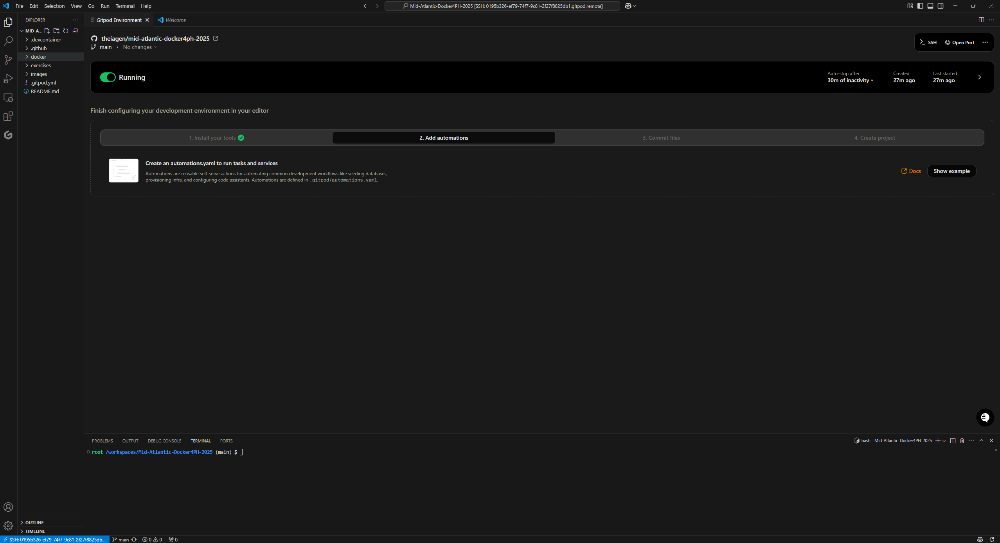

# Docker for Public Health Bioinformatics
A Mid-Atlantic Workforce Development Offering Provided by the Division of Consolidated Laboratory Services in Collaboration with Theiagen Genomics

## Content
- [Overview](#overview) 
  - [Training Objectives](#training-objectives)
  - [Target Audience](#target-audience)
  - [Course Format](#course-format)
- [Course Content](#course-content)
- [Prerequisites for Hands-On Exercises](#prerequisites-for-hands-on-exercises)

## Overview 
The Division of Consolidated Laboratory Services, in collaboration with Theiagen Genomics, will be hosting a Docker for Public Health Bioinformatics Course. This will be a virtual course hosted on Tuesdays and Thursdays via Zoom from **April 1st - 24th, 2025**. All training materials will be hosted on this GitHub page to encourage self-paced and asynchronous learning. 

### Training Objectives
- Articulate the utility of Docker and software containerization and their applications in public health bioinformatics;
- Describe the advantages and challenges of using containerized software for interoperable and reproducible pathogen genomics;
- Gain experience with the steps involved in developing and testing containerized software for use in public health bioinformatics;
- Gain familiarity with community-driven resources for public health bioinformatics such as StaPH-B’s docker container repository.

### Target Audience
This course is designed for bioinformatics scientists interested in strengthening their skill sets as container developers. The following are pre-requisites for participation in the course:  
- Previous experience in bioinformatics, specifically accessing open-source tools through a command-line interface and installing these tools on a Linux environment;
- Have a GitHub account (or the ability to create one) (see [Prerequisites for Hands-On Exercises](#prerequisites-for-hands-on-exercises));
- Have Visual Studio Code installed (see [Prerequisites for Hands-On Exercises](#prerequisites-for-hands-on-exercises)). 

### Course Format 
This will be a 4-week training series occurring on Tuesdays and Thursdays from April 1st - 24th, 2025: 
- Tuesdays (90 min): Lecture material with hands-on exercises
- Thursdays (60 min): "Office hours" style meeting where participants can ask any questions about the material, and the trainers will address any errors encountered by participants.

A pre-training kick-off will be held on Monday, March 31st 2025.
All **lecture content** will be recorded and made available through this GitHub repository to facilitate self-paced and asynchronous learning.

## Course Content

### Slides & Exercises
**Week 00: Training Kick-Off**
- [Lecture Slides](./slides/Week%200%20-%20Mid-Atlantic%20WFD%20Training%20Workshop_%20Training%20Kick%20Off.pdf)
- [Recording](https://youtu.be/kxvOyKFBZuI)

**Week 01: Container Repositories and Writing Dockerfiles**
- [Lecture Slides](./slides/Week%201%20Lecture%20-%20Mid-Atlantic%20WFD%20Training%20Workshop_%20Introduction%20to%20Docker%20and%20Containerization.pdf)
- [Recording](https://youtu.be/9bOahUbAWjI)
- [Exercise 01: Accessing the Course Repository, VS Code and Docker](./exercises/exercise01.md)

**Week 02: Container Repositories and Writing Dockerfiles**
- [Lecture Slides](slides/Week%202%20Lecture%20-%20Mid-Atlantic%20WFD%20Training%20Workshop_%20Container%20Repositories%20and%20Writing%20Dockerfiles.pdf)
- [Recording](https://youtu.be/x9llgA8CDR0)
- [Exercise 02: Writing Dockerfiles to Build Docker Images](./exercises/exercise02.md)

**Week 03: Developing Custom Docker Images**
- [Lecture Slides]()
- [Recording]()
- [Exercise 03: Building and Sharing a Custom Dockerfile](./exercises/exercise03.md)

**Week 04: StaPH-B Docker-Builds Repository and Course Review**
- [Lecture Slides]()
- [Recording]()
- [Exercise 04: Employing StaPH-B Docker Images](./exercises/exercise04.md)

## Prerequisites for Hands-On Exercises
In addition to lectures, this course consists of several hands-on exercises to reinforce the coursework material. To participate in these exercises, trainees will need the following resources: 

### GitHub Account
If you don't already have a GitHub account, please go to github.com and register (it's free!). To sign in to GitHub, please follow the URL at https://github.com/signup
  - Once you have registered, ensure you are signed into your account at https://github.com

### Visual Studio Code
Visual Studio Code, commonly referred to as VS Code, is an Integrated Development Environment (IDE) developed by Microsoft for Windows, Linux, and macOS. Features include support for debugging, syntax highlighting, and embedded version control with Git. VS Code supports almost every major programming language. 
- You can download VS Code for your system at https://code.visualstudio.com 

### GitPod Flex Account 
- Navigate to https://app.gitpod.io/
- Select "Continue with GitHub", authorize Gitpod to access your GitHub account, and sign in with your credentials

#### Creating your own organisation
Once your account is connected to GitPod, it will prompt you to create an organization. Unfortunately, this step cannot be skipped. You create an organization with whatever name you wish, this will not matter once you are invited to this course's organization. 
  - Note that the organization name will depend on the  cohort and year of the course you are attending, matching this repository name.  

  

#### GitPod Flex Configuration for Public Repositories
Once registered and part of this course's organization, navigate to the **Create Environment** button on the top right panel of your screen.

  

  - Create a new environment and connect with the course's repository `https://github.com/theiagen/Mid-Atlantic-Docker4PH-2025`.

  

  - You'll be prompted to connect to GitHub via an access token. Select the **Developer Settings** URL and follow the configuration process on GitHub.

  

  

  - Paste the Personal Access token in the required field and click **Connect**. 

#### GitPod Workspace
  - Once your workspace is running, select **Open with VS Code**

  

  - VS Code will open, and you'll be prompted to install GitPod Extension and connect to your new environment. Click **"Install Extension and Open URI"**

  

  

🚨**NOTE**🚨 Once you're finished working, make sure to shut down your workspace in GitPod. There are a few ways to stop your workspace from running! It will auto-stop after 30 minutes of inactivity to save resources, but you can force it to stop by clicking on the **toggle next to the status information**. 

## Available Docker images

| Software | Version | Link |
| :--------: | ------- | -------- |
| NCBI Datasets | <ul><li>[14.20.0](./docker/ncbi-datasets/14.20.0/)</li></ul> | [https://github.com/ncbi/datasets](https://github.com/ncbi/datasets)  [https://www.ncbi.nlm.nih.gov/datasets/docs/v1/](https://www.ncbi.nlm.nih.gov/datasets/docs/v1/) |
| SPAdes | <ul><li>[4.0.0](./build-files/spades/4.0.0/)</li></ul> | https://github.com/ablab/spades   http://cab.spbu.ru/software/spades/ |

