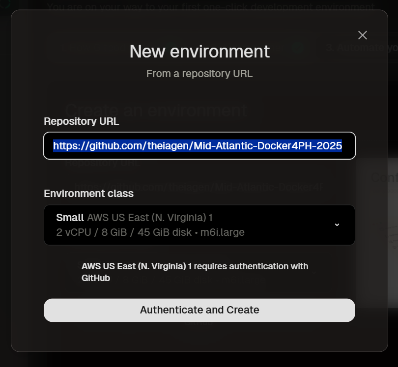
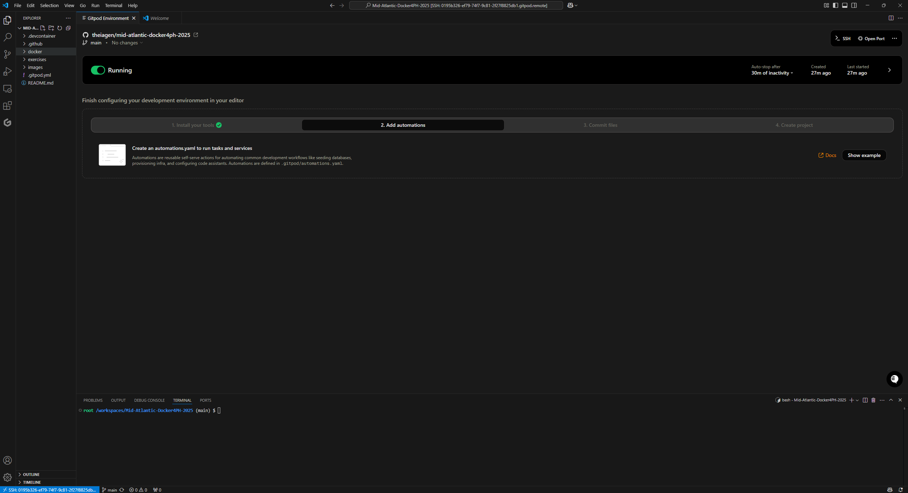

# Exercise 01: Accessing the Course Repository, VS Code and Docker

1. Use GitPod Flex to create a dev environment:
    - Navigate to https://app.gitpod.io/
    - Select "Continue with GitHub", authorize Gitpod to access your GitHub account, and sign in with your credentials
    - In the Mid-Atlantic-Docker4PH-2025 organization, create a new environment
    - Set the repository to https://github.com/theiagen/Mid-Atlantic-Docker4PH-2025 
    - Click on the "Open with VS Code" button

<p align="center">
  
</p>

<p align="center">
  
</p>

<p align="center">
  
</p>

## The VS Code environment

2. Familiarize yourself with the VSCode environment

<p align="center">
  
</p>

3. Create a new file
    - Click on **File** > **New File**
    - Save it as `test.md` in a folder of your choice
    - Write some text and save the file (click on **File**>**Save** or click on `CTRL + S`):
        ```markdown
        This is an example of some text.
        ```
    - Preview the File by clicking the "Open Preview to the Side" button

<p align="center">
  
</p>

4. Use the integrated terminal
    - Open the terminal by going to **Terminal**>**New Terminal**
    - Run a simple command
    ```bash
    echo "Hello from VS Code!"
    ```
    - Close the Terminal by clicking the trashcan icon on the top right of the terminal window.

## Docker and Containers

5. Docker basics
     - Re-open the terminal and run the following commands:
     ```bash
     docker --version
     docker --help
     command -V docker
     docker pull --help
     ```
    - What happens when you run this command?
    ```bash
    docker run hello-world
    ```
    - The `docker images` is a command to list all docker images available in your system. What docker images are available on your computer now?
    ```bash
    docker images
    ```

6. Downloading docker images
    - We're going to download a docker image from this docker hub repository: [https://hub.docker.com/r/staphb/ncbi-datasets](https://hub.docker.com/r/staphb/ncbi-datasets). Run the following command to download the StaPH-B docker image that contains the NCBI `datasets` command-line tool. [More info on the command line tool `datasets` can be found here](https://www.ncbi.nlm.nih.gov/datasets/docs/v2/getting_started/)
    ```bash
    docker pull staphb/ncbi-datasets:14.20.0
    ```
    - Now run the command `docker images` again - what has changed?

7. Docker images vs containers
    - When you ran the command `docker run hello-world` earlier, docker started a container using the docker image called `hello-world`, ran some things, and then the container automatically exited. The container did not delete itself, and we can see that by running the command `docker ps --all`:
    ```
    docker ps --all
    ```
    - You can tell `docker` to automatically delete the container after exiting with the `docker run --rm` flag. Let's try it out. Run the following command which will download and run a command in a new docker container:
    ```
    docker run --rm ubuntu:focal echo "hello from inside the container!"
    ```
    - Now, run `docker ps --all` - do we see a container listed for the command we just ran? We should **not see it listed**, as long as the `docker run --rm` flag was included. Now try the same command without the `--rm` flag:
    ```bash
    docker run ubuntu:focal echo "hello from inside the container!"
    ```
    - Look at the list of containers again:
    ```bash
    docker ps --all
    ```

8. Running docker images - Interactive mode
    - You can launch into a container interactively, and be given a pseudo-shell from which you can run commands. You will need to use the `docker run -it` flags to do this:
    ```bash
    docker run -it staphb/ncbi-datasets:14.20.0
    ```
    - Inside this pseudo-shell, you can run many commands. Try running the following:
    ```bash
    pwd
    ls
    cd /
    ls
    ```
    - To exit you just need the following command:
    ```bash
    exit
    ```

9. Running docker images - Non-interactive mode
    - The default method of running a container does not launch an interactive terminal, but rather, a command or set of commands is passed into the container. The format is as follows:
    ```bash
    # format
    docker run <name-of-docker-image>:<tag> <command>
    ```
    - Try running the following:
    ```bash
    docker run ubuntu:focal echo "hello!"
    ```

10. File permissions in docker
    - By default, when you launch a container with `docker run`, any commands run will be run as the `root` Linux user. Thus, any files created will be owned by the `root` user, limiting the downstream use of these files by non-`root` Linux users. Non-`root` users may encounter file permission errors if attempting to delete or edit files owned by `root`.
    - To avoid these issues, you can pass in your Linux user ID (UID) and group ID (GID) so that the container runs with your user and group IDs. The flag to pass in user and group IDs is `docker run --user <user-id>:<group-id>` or `docker run -u <user-id>:<group-id>` for short
    ```bash
    # change directories so that we have a relatively clean working environment
    cd training/

    # launch the container in interactive mode
    docker run -it staphb/ncbi-datasets:14.20.0

    # create a file called "test.txt"
    touch test.txt

    # look at the permissions for this file
    ls -lh

    # see what the current user you're logged in as
    whoami

    # exit the container with the command 'exit'
    exit
    ```
    - Now let's launch the container in interactive mode, but pass in our user and group ID. Instead of looking up your user and group IDs, you can look up these IDs on the fly with `id -u` and `id -g`
    ```bash
    # launch the container in interactive mode again, but this time pass in our user and group IDs
    docker run -u $(id -u):$(id -g) -it staphb/ncbi-datasets:14.20.0

    # change to /tmp
    cd /tmp

    # create a file called "test.txt"
    touch test.txt

    # look at the permissions for this file
    ls -lh

    # see what the current user you're logged in as
    whoami

    # exit the container with the command 'exit'. Your command prompt should go back to it's default
    exit
    ```

# Using Docker Containers

11. Passing files in and out of containers
    - Docker containers have filesystems that are completely separate and isolated from your host computer's filesystem. You can mount a "volume" between your host computer's filesystem and the container filesystem to pass files in and out.
    - Files created inside of containers are not automatically exported from the container so we must use the `--volume <path-on-host>:<path-in-container>` or `-v <path-on-host>:<path-in-container>` (shorthand). You must tell `docker` which path to mount from your host system, and the path on the container's filesystem to mount the volume to. It's OK if the path inside the container does not exist, it will be created.
    - If my present working directory (`$PWD`) is `/home/imendes`, then I can mount my $PWD to `/data` in the container's filesystem like so:
    ```
    docker run --volume $PWD:/data ubuntu:focal <command>
    ```
    - Let's pass a file into a container. First, make a test text file, and then pass it into the container:
    ```bash
    # create the text file which contains the text "this is a test
    echo "this is a test">text.txt

    # mount your PWD to /data inside the container and list the contents of /data in the container filesystem
    docker run --volume $PWD:/data ubuntu:focal ls /data

    # same as before, but cat the test.txt file from inside the container
    docker run --volume $PWD:/data ubuntu:focal cat /data/text.txt
    ```
    - Now let's create a file inside the docker container, and then save it to our host computer for usage later:

    ```bash
    # create a file inside the container using the "touch" command, writing to /data in the container
    docker run --volume $PWD:/data ubuntu:focal touch /data/file-made-inside-container.txt

    # let's check and make sure that the new file exists on our host computer filesystem:
    ls

    # what happens when we don't mount a volume and create a file inside the container?
    docker run ubuntu:focal touch file-made-inside-container-NO-VOLUME.txt

    # is this new file present on our host filesystem? Run this command to check:
    ls file-made-inside-container-NO-VOLUME.txt
    ```

12. Now that we've covered some of the basics of `docker` on the command line, let's download a *Klebsiella pneumoniae* genome FASTA file from NCBI. We downloaded the docker image called earlier, so now let's use it to download the FASTA file. We're going to download this genome: https://www.ncbi.nlm.nih.gov/data-hub/genome/GCF_000240185.1/. Launch the `datasets` docker image interactively:
    ```bash
    ### launch the container in interactive mode ###
    # --rm is to remove the container after it exits (i.e. delete the container)
    # -v is for mounting my filesystem to the container filesystem
    # -u is for passing in my user ID and group ID
    # -it is 2 flags for launching interactive mode
    docker run --rm -v $PWD:/data -u $(id -u):$(id -g) -it staphb/ncbi-datasets:14.20.0

    # run the datasets tool to download the FASTA file (along with some other metadata)
    datasets download genome accession GCF_000240185.1

    # unzip the .zip archive
    unzip ncbi_dataset.zip

    # exit the container
    exit

    # take a peek at the top of the FASTA file
    head -n 4 ncbi_dataset/data/GCF_000240185.1/GCF_000240185.1_ASM24018v2_genomic.fna
    ```

13. Run `kleborate` on FASTA file for subtyping, serotyping, virulence and AMR prediction
    - Now that we have downloaded our FASTA file, let's launch into the container in interactive mode, and run `kleborate`
    ```bash
    # download the docker image "staphb/kleborate:2.3.2-2023-05" and launch interactive mode
    docker run --rm -v $PWD:/data -u $(id -u):$(id -g) -it staphb/kleborate:2.3.2-2023-05

    # run kleborate using the FASTA file as input (be patient, this step may take a few minutes to run....)
    kleborate --all -o results.tsv -a ncbi_dataset/data/GCF_000240185.1/GCF_000240185.1_ASM24018v2_genomic.fna

    # exit the container
    exit

    # view results of Kleborate
    cat results.tsv
    ```

## Shutting Down the Environment

14. Once you're finished working, make sure to shut down your workspace. Click on the toggle next to "Running", either on VS Code or on Gitpod Flex platform, to turn everything off.
