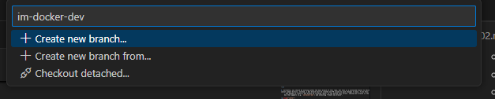
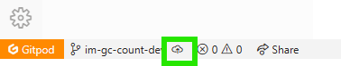
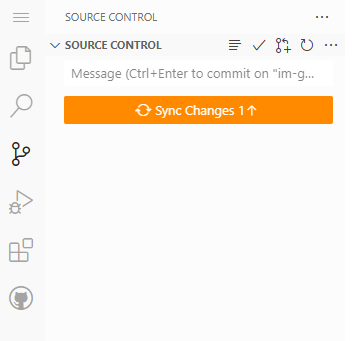
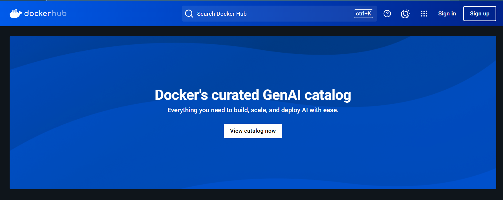

# Exercise 02: Writing Dockerfiles to Build Docker Images

1. Access your dev environment through GitPod:
    - Navigate to https://app.gitpod.io/
        - If needed, select "Continue with GitHub", authorize Gitpod to access your GitHub account, and sign in with your credentials
    - In the Mid-Atlantic-Docker4PH-2025 organization page, click on the existing environment at the bottom of the right-side column
    - Restart the environment
    - Click on the "Open with VS Code" button

<p align="center">
  
</p>

## [Optional] Branch for Week 2

2. Currently, you should be working within the `main` branch of this repo, but this is a protected branch to which we cannot commit direcly. Instead, a dev branch must be created and PR issued to push changes to `main`. To do this:
    - Use VSCode to create a dev branch by clicking "main" in the bottom left corner, naming your branch in the text box that appears (e.g. `im-docker-week2-dev`) and selecting "Create new branch".

<p align="center">
  
</p>

  - Click the push icon in the bottom-left corner of your VSCode interface to publish this branch to the remote repository.

<p align="center">
  
</p>

3. From your newly created dev branch, use the VSCode interface to build some Docker images! In today's exercise, we are going to practice building Docker images in various ways. Let's tweak the Dockerfiles and see how those changes impact the final Docker image.

## Building a Pre-Existing Dockerfile

4. Let's build the most recent version of [NCBI `datasets`](https://github.com/ncbi/datasets) available in this repository using the Dockerfile located here: `docker/ncbi-datasets/14.20.0/Dockerfile`
    ```bash
    docker build --tag ncbi-datasets:14.20.0 ncbi-datasets/14.20.0/
    ```
    - What happened when we ran this command?
        - Docker daemon read & interpreted the Dockerfile. It also ensured correct syntax & format.
        - The base image `ubuntu:jammy` was downloaded if not already present on the computer.
        - Daemon began running subsequent Dockerfile instructions (`RUN`, `WORKDIR`, etc) in order through to the end of the Dockerfile.
        - Docker image was given a sha256 hash & we received a message saying Docker image was named & built successfully.

5. Do the same with the [SPAdes](https://github.com/ablab/spades) Dockerfile located at `docker/spades/4.0.0/Dockerfile` 

## Editing a Pre-Existing Dockerfile

6. Using the available Dockerfile for [SPAdes](https://github.com/ablab/spades), create a new Dockerfile for the latest version available (latest release: https://github.com/ablab/spades/releases)
    - Don't forget to add yourself as maintainer of the Dockerfile
    - [Optional] Add a test layer to your Dockerfile
    ```Dockerfile
    # download test FASTQ files from ENA
    # run SPAdes on FASTQ files
    RUN wget ftp://ftp.sra.ebi.ac.uk/vol1/fastq/SRR690/006/SRR6903006/SRR6903006_1.fastq.gz && \
    wget ftp://ftp.sra.ebi.ac.uk/vol1/fastq/SRR690/006/SRR6903006/SRR6903006_2.fastq.gz && \
    spades.py -t 4 --isolate --only-assembler -1 SRR6903006_1.fastq.gz -2 SRR6903006_2.fastq.gz -o spades-output
    ```

7. Commit these changes with a comment, e.g. `updating SPAdes Dockerfile to version XXX`, replacing `XXX` with the version of SPAdes for which you've build the container for.

## [Optional] Sync Changes to Branch and Open a Pull Request to `main`

8. Use the Sync Changes button that appears to publish this branch to the remote repository.

<p align="center">
  
</p>

9. Navigate to the remote repository on GitHub and select your dev branch. 

10. Use the "Contribute" dropdown menu to open a pull request. 

11. Complete the PR form for this repository and create the pull request

## [Extra content] Pushing to a remote Docker repository

12. Once you have successfully built your Docker image for [SPAdes](https://github.com/ablab/spades), you may want to share it by pushing it to a remote Docker repository, such as [Docker Hub](https://hub.docker.com/).

13. Navigate to https://hub.docker.com/ and register for an account. 

<p align="center">
  
</p>

14. On your terminal environment, Log in to Docker Hub. You'll be prompted to enter your Docker Hub username and password.
    ```bash
    docker login
    ```

15. Before pushing, you need to tag your image with your Docker Hub username and repository name. 
    - If your Docker Hub username is `yourusername` and you want to store the image in a repository named `spades`, tag the image like this:
    ```bash
    docker tag spades:latest yourusername/spades:latest
    ```
    - Alternatively, if you want to include a specific version (e.g., `4.1.1`), tag it like this:
    ```bash
    docker tag spades:latest yourusername/spades:4.1.1
    ```

16. Now, push the tagged image to your Docker Hub repository:
    ```bash
    docker push yourusername/spades:latest
    ```
    - If you tagged a specific version, push it with:
    ```bash
    docker push yourusername/spades:4.1.1
    ```

17. Once the push is complete, you can verify that your image is available on Docker Hub by visiting `https://hub.docker.com/r/yourusername/spades`
    - You can also check from the terminal:
    ```bash
    docker search yourusername/spades
    ```

18. Optionally, pull the image to test that it is available for others to use:
    ```bash
    docker pull yourusername/spades:latest
    ``` 

## Shutting Down the Environment

19. Once you're finished working, make sure to shut down your workspace. Click on the toggle next to "Running", either on VS Code or on Gitpod Flex platform, to turn everything off.
