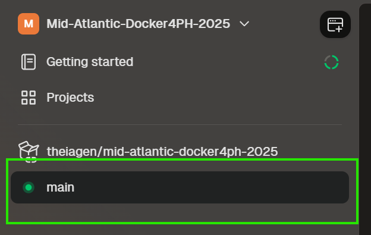
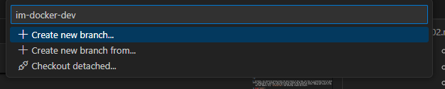

# Exercise 02: Developing Custom Docker Images

1. Access your dev environment through GitPod:
    - Navigate to https://app.gitpod.io/
        - If needed, select "Continue with GitHub", authorize Gitpod to access your GitHub account, and sign in with your credentials
    - In the `<COHORT>`-Docker4PH-`<YEAR>` organization page, click on the existing environment at the bottom of the right-side column
    - Restart the environment
    - Click on the "Open with VS Code" button

<p align="center">
  
</p>

## [Optional] Branch for Week 3

2. Return to the `main` branch of this repo by selecting the current branch name at the bottom of the VS Code window. Ensure that you have the latest modifications by syncing with the remote repository

<p align="center">
  
</p>

  - Use VSCode to create a dev branch by clicking "main" in the bottom left corner, naming your branch in the text box that appears (e.g. `im-docker-week3-dev`) and selecting "Create new branch".

<p align="center">
  
</p>

  - Click the push icon in the bottom-left corner of your VSCode interface to publish this branch to the remote repository.

<p align="center">
  
</p>

3. From your newly created dev branch, use the VSCode interface to build some custom Docker images! 

## Choosing a Tool to Containerize

4. Identify the tool you wish to package in a Docker container. It could be a workflow, a command-line utility, or anything. We recommend starting simple and selecting something with few dependencies. We suggest a pre-compiled assembler, such as [Flye](https://hub.docker.com/r/staphb/flye) or a mapper such as [minimap2](https://hub.docker.com/r/staphb/minimap2).

<details>
 <summary> Taking inspiration
 </summary><br />

The [State Public Health Bioinformatics Workgroup (StaPH-B)](https://github.com/StaPH-B) maintains a repository of Dockerfiles and documentation on tools for public health bioinformatics. You can find it at https://github.com/StaPH-B/docker-builds. 

</details>

5. Identify the recommended installation mode. Is it through a pre-compiled binary? Is it available on a package manager such as [Conda](https://docs.conda.io/en/latest/)? Is it a Python utility?

<details>
 <summary> Available examples
 </summary><br />

Depending on the type of tool you choose, several Dockerfile examples are available [on this repository](../docker/example/).
  - Standard [Dockerfile](../docker/example/Dockerfile)
  - [Dockerfile](../docker/example/Dockerfile-mamba) leveraging [mamba](https://github.com/mamba-org/mamba) (a faster alternative to Conda)
  - [Dockerfile](../docker/example/Dockerfile-python3) for a python3 package 

</details>

## Setup the Repository

6. On the [docker](../docker/) folder, create a new directory for your new tool, and then another directory inside it for the version of the tool for which you'll be creating the Dockerfile. Create the `Dockerfile` and `README.md` files. 

<p align="center">
  
</p>

7. A Dockerfile is essentially a text file (literally written as "Dockerfile" with no extension) that contains instructions for creating a Docker image. These instructions are written in the following format:
    ```bash
    DIRECTIVE argument
    ```
    - Although the DIRECTIVE is case-insensitive, it is recommended that all directives be written in uppercase to differentiate them from arguments.
    - A Dockerfile usually consists of multiple lines of instructions that the Docker engine executes sequentially during the image-building process.

8. A Dockerfile typically follows these steps:
    - Determine your base image
    - Install application dependencies
    - Copy/Download any relevant source code and/or binaries
    - Configure the final image

9. The README file contains information about the tool. An example is available [here](../docker/example/README.md). 

## Specify the Base Image and LABEL Information

10. The very first instruction you write in a Dockerfile must be the FROM directive, which specifies the base image. The base image is the image from which all other layers in your Docker image will be built. It's the foundation of your Docker image, much like the foundation of a building.
    - Note that the base image you specify will be downloaded from [Docker Hub](https://hub.docker.com), Docker's official image registry, but alternatives can be used such as [Quay](https://quay.io/) or [Google's Artifact Registry](https://cloud.google.com/artifact-registry/docs).
    - For a ubuntu-based base layer, you can use the following FROM directive:
    ```bash
    FROM ubuntu:jammy
    ```

11. Add any information that might be useful to the user with the `LABEL` directive:
    ```bash
    LABEL base.image="ubuntu:jammy"
    LABEL dockerfile.version="1"
    LABEL software="SoftwareName"
    LABEL software.version="1.0.0"
    LABEL description="This software does X, Y, AND Z!"
    LABEL website="https://github.com/StaPH-B/docker-builds"
    LABEL license="https://github.com/StaPH-B/docker-builds/blob/master/LICENSE"
    LABEL maintainer="FirstName LastName"
    LABEL maintainer.email="my.email@email.com"
    ```

## Install the Dependencies

11. If you're using [mamba](https://github.com/mamba-org/mamba)/[conda](https://docs.conda.io/en/latest/), the dependencies are probably handled for you, but for a bare isntallation on an ubuntu system, you'll need to install the required software with `apt`. 
    ```bash
    RUN apt-get update && apt-get install -y --no-install-recommends \
        dependency_a \
        dependency_b \
        dependency_c && \
        apt-get autoclean && rm -rf /var/lib/apt/lists/*
    ``` 

## Install the Software

12. Install whatever software you choose. You can use the `ARG` directive to define arguments within the Dockerfile. 
    ```bash
    # Example: install ncbi-blast+ 2.9.0 pre-compiled Linux binaries
    ARG BLAST_VER=2.9.0

    RUN wget ftp://ftp.ncbi.nlm.nih.gov/blast/executables/blast+/${BLAST_VER}/ncbi-blast-${BLAST_VER}+-x64-linux.tar.gz && \
    tar -xzf ncbi-blast-${BLAST_VER}+-x64-linux.tar.gz && \
    rm ncbi-blast-${BLAST_VER}+-x64-linux.tar.gz && \

    # 'ENV' instructions set environment variables that persist from the build into the resulting image
    # Use for e.g. $PATH and locale settings for compatibility with Singularity
    ENV PATH="/software-${SOFTWARENAME_VER}/bin:$PATH" \
      LC_ALL=C
    ```

13. Optionally, you can add a test layer within your Dockerfile to check that everything is working as expected:
    ```bash
    # Run the program's internal tests if available, for example with SPAdes:
    RUN spades.py --test
    ```

## Build and Test the Docker Image

14. IN THE DIRECTORY WHERE THE DOCKERFILE IS LOCATED, build the image using the following command (replace <your-tool-name> with the actual name of your tool and <tag> with the version of the tool):
    ```bash
    docker build -t <your-tool-name>:<tag> .
    ```
    - Alternatively, you can provide the full path of the Dockerfile to the `build` command:
    ```bash
    docker build -t <your-tool-name>:<tag> /path/to/Dockerfile
    ```

## [Optional] Push your Image to Docker Hub

15. If you want to share your Docker image, tag and push it to [Docker Hub](https://hub.docker.com/):
    ```bash
    docker tag <your-tool-name>:<tag> yourusername/<your-tool-name>:<tag>
    docker push yourusername/<your-tool-name>:<tag>
    ```

## [Optional] Submit Your Work

16. Create a Pull Request to this repository to share your Dockerfile with the cohort! 
    - First, save and commit your Dockerfile to your development branch;
    - On GitHub, open a Pull Request from your development branch to `main`;
    - Don't forget to update the table on the main [README](../README.md#available-docker-images) of this repository!
    - Make sure that all tests are passing! A review and approval from a repository administrator is required prior to merging your changes. 

## Shutting Down the Environment

17. Once you're finished working, make sure to shut down your workspace. Click on the toggle next to "Running", either on VS Code or on Gitpod Flex platform, to turn everything off.

