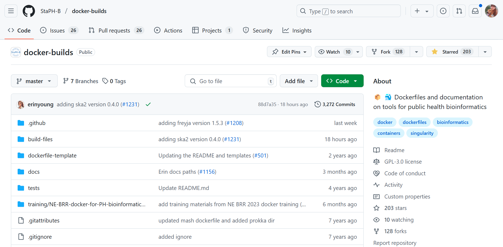
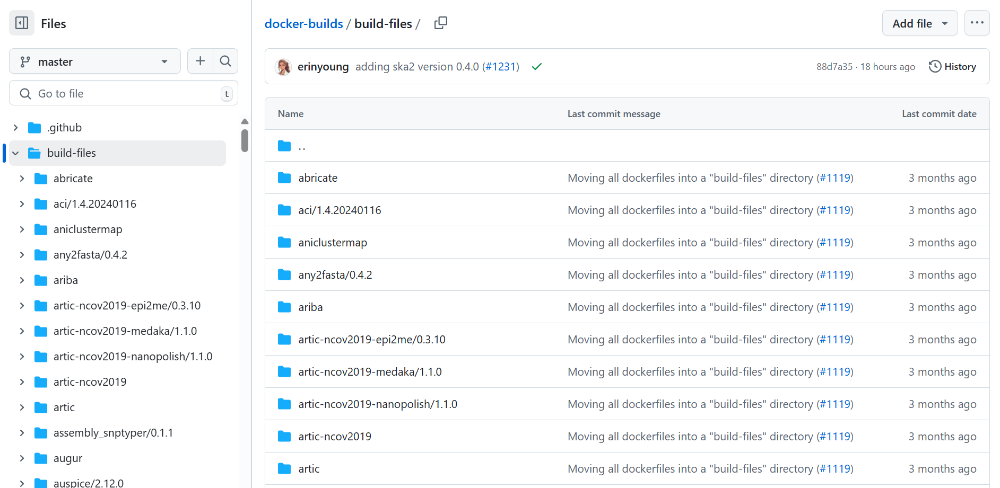
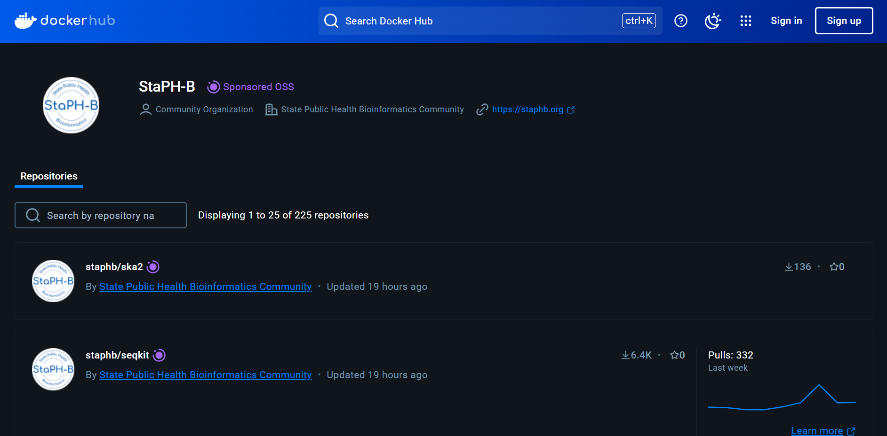
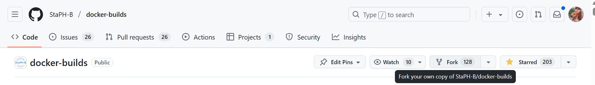
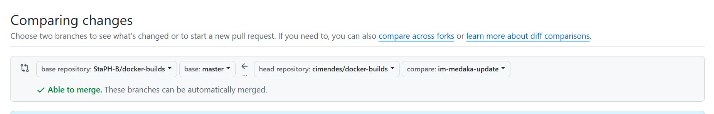

# Exercise 03: Employing StaPH-B Docker Images

1. Navigate to [StaPH-B Docker repository](https://github.com/StaPH-B/docker-builds/)

  

2. This repository contains Dockerfiles for various bioinformatics tools. Explore all the Dockerfiles available under the `build-files` folder:
    -  Each tool has its own directory containing a Dockerfile and sometimes additional scripts;

  

3. Take a moment to understand the structure of a given Dockerfile in this repository. Look for:
    - Base image (e.g., FROM debian:stable)
    - Installation steps (RUN apt-get install...)
    - Work directories (WORKDIR /app)
    - Default command (CMD ["abricate", "--help"])

 
 💡 Consider:
 
 

Can this Dockerfile be optimized? Could you use a smaller base image like Alpine?

4. All Docker images are hosted on Docker Hub, under https://hub.docker.com/u/staphb. Explore this page.

  

## [Optional] Contribute to StaPH-B's repository

5. Fork the StaPH-B's repository to your account:

  

6. In a new environment, open your forked repository

  

7. By following [StaPH-B's Guidelines](https://staphb.org/docker-builds/contribute/), contribute to this repository by creating a new Dockerfile or updating the Dockerfile for the latest version of a tool available.
    - **Create a development branch to add your modifications to;**
      - There are Dockerfile and README templates that can be copied from https://github.com/StaPH-B/docker-builds/tree/master/dockerfile-template;
    - Don't forget to test your Dockerfile locally before committing and pushing it to your branch;

8. When you're ready, open a Pull Request on [StaPH-B's repository](https://github.com/StaPH-B/docker-builds/pulls) by clicking on `New pull request` under the `Pull requests` tab.
    - Click on the `Compare across forks` blue link to open the option to compare across forks;
    - Select as `head repository` your fork, under your username, and the branch wto hich you've made your alterations;
    - click on "Create pull request" and follow the steps set by StaPH-B's pull request template.

  

